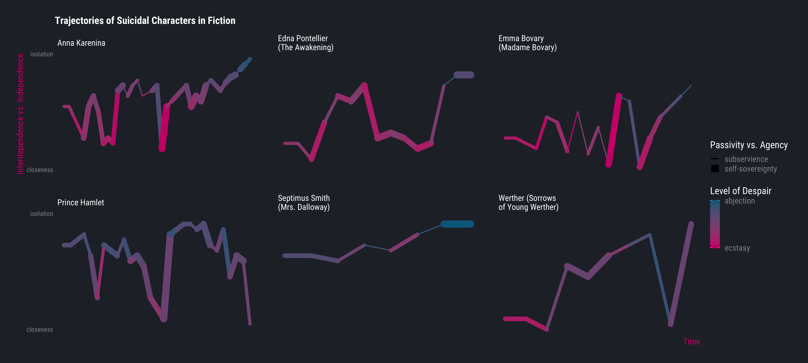
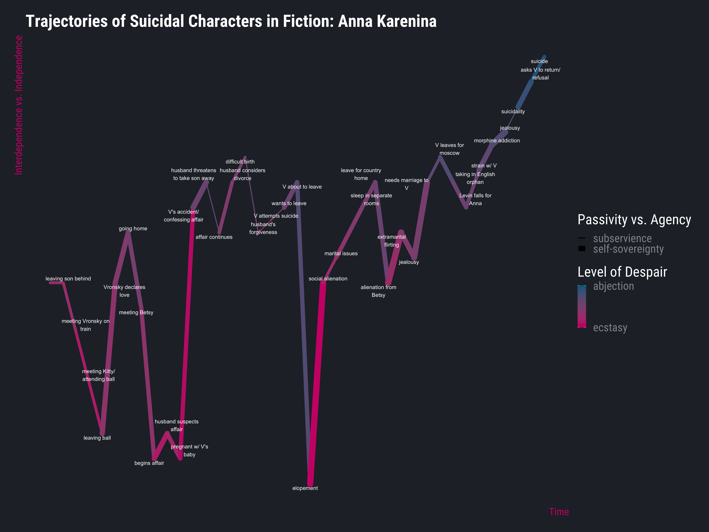
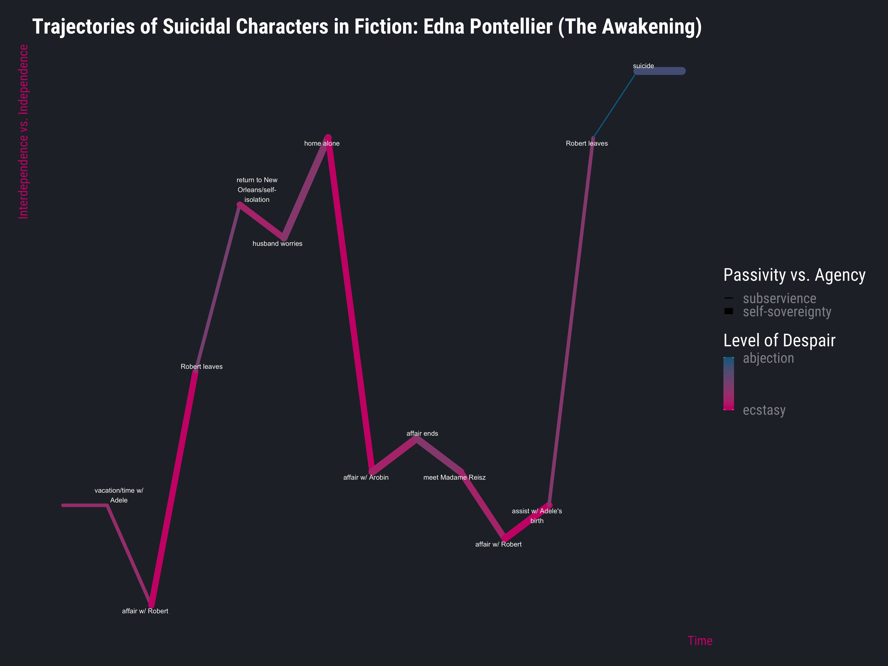
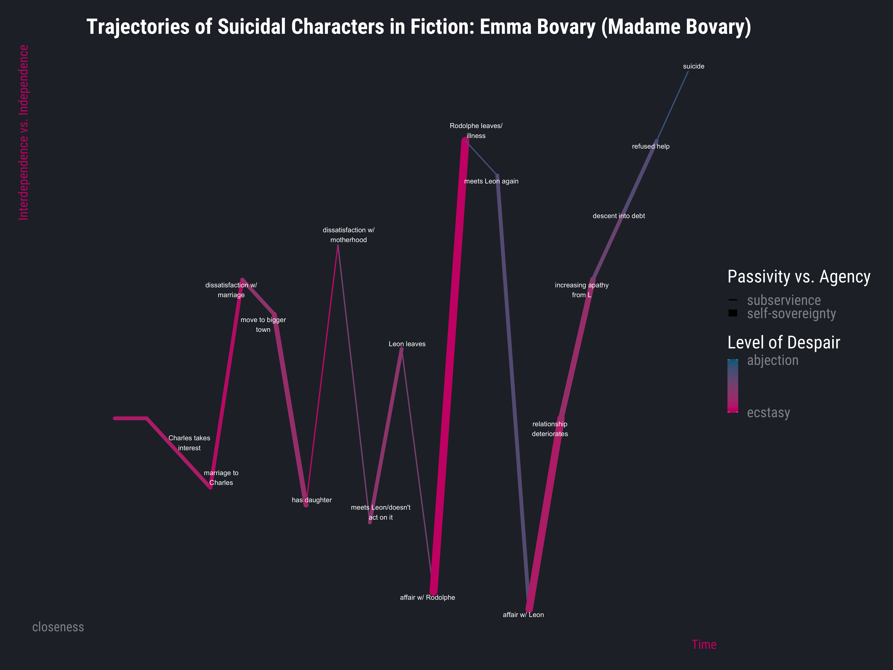
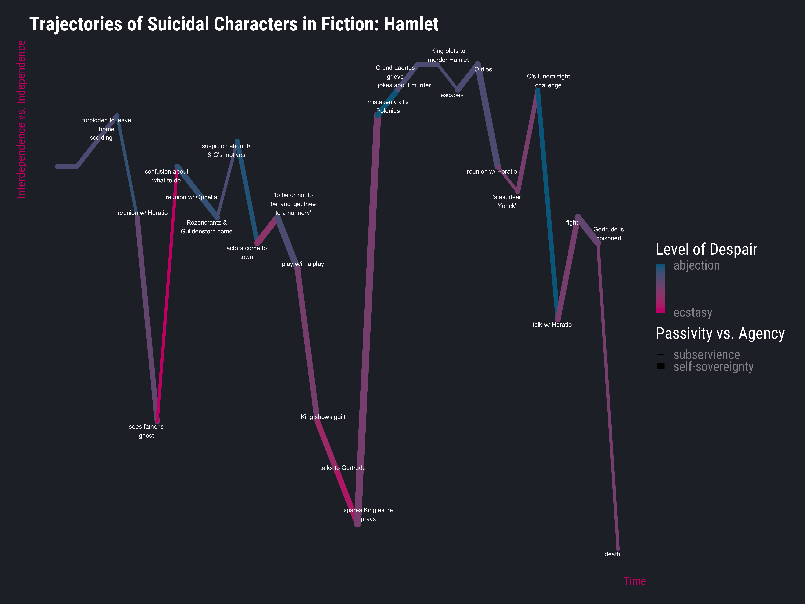
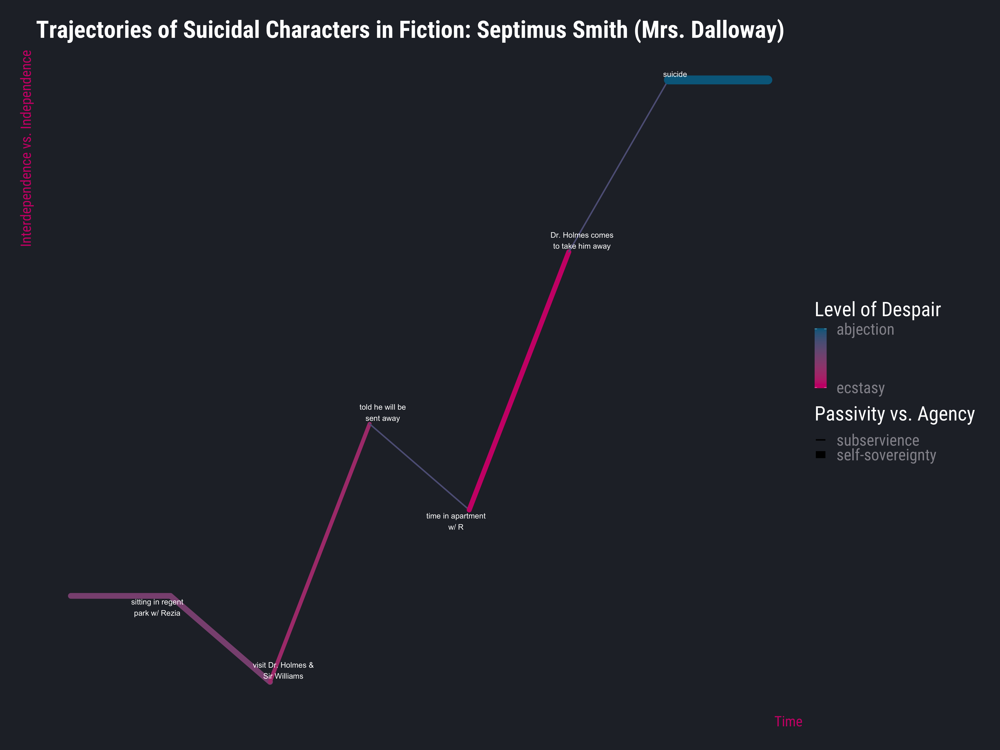
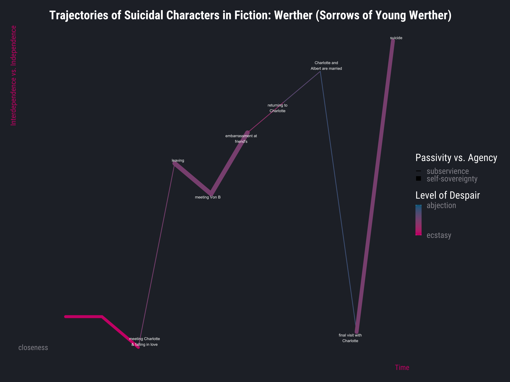

# Context

This data visualization process was my final project for a class on visualizing social and political data. For this project, I looked at the timeline of events for each protagonist in six famous works of suicide fiction (works in which a protagonist contemplates, attempts, and/or completes suicide). I visualized these timelines along four dimensions: time, closeness/isolation with other characters, powerlessness/agency, and level of despair. These were visualized in a single multi-faceted plot and in separate plots for each character in which events are labelled. My visualizations are interpreted below.

# Writeup

“To Be or Not to Be,” from Shakespeare’s Hamlet, is one of the most famous monologues in all English literature, and it is certainly the most famous literary passage about suicide. While Hamlet does not survive his play, he does, in some sense, survive the desire to die, dying as he does at another’s hand. Other figures in literature do not survive their suicidality: Tolstoy’s Anna Karenina, Virginia Woolf’s Septimus Smith from her novel Mrs. Dalloway, Goethe’s Werther from The Sorrows of Young Werther, Edna Pontellier from Kate Chopin’s The Awakening, and Flaubert’s Emma Bovary from Madame Bovary are some of the most famous figures of suicide fiction. I am interested in the question of how literary narratives about suicide formulate the identity and role of the suicidal person. Novels and plays populate one subset of cultural narratives as concerns suicide and suicidality; I believe that a deepened understanding of these narratives begins to elucidate the identity formation and narrativizing processes for those affected by suicide and suicidality. While the scope of this particular project is necessary limited, it is part of a larger effort to understand suicide narratives and, in so doing, perhaps help us move towards more effective policy-based, cultural, clinical, and interpersonal strategies and procedures to better care for and recognize those whose lives have been affected by suicide.
My analysis here looks at the trajectories of the six aforementioned suicidal figures in their stories. These trajectories are plotted in terms of a) level of despair, b) a character’s closeness/intimacy with others as opposed to their independence/isolation, c) a character’s level of passivity/powerlessness as opposed to their agency/power, and d) narrative time. I have one faceted plot for all the characters and individual plots for each novel.

## I. Plot Creation
To create this plot, I read each of the six books and wrote down major events in each as I read. Afterwards, I hand-drew plots with an x-axis for time and a y-axis for closeness vs. isolation. I used line thickness to render powerlessness vs. agency. I made a couple drafts of each to make sure I stood by my rendering. I then created an excel spreadsheet where I noted closeness vs. isolation, powerlessness vs. agency, and level of despair for each event. I had the first event at time 0 and the final event at time 1 and gave a fractional time-stamp for each event. I made these time-stamps equidistant rather than reflective of the actual relative time within each narrative.

To interpret this plot, it’s important to note that both thickness and color relate to the point at the beginning of a line segment. In terms of design principles, I want to acknowledge that the data-ink ratio of this plot isn’t as high as Edward Tufte might have liked – there’s a lot of text here. Given the content, however, I believe this to be necessary. What I’m plotting here is, in some ways, meaning: there’s no way to plot this without making explicit the names and principles in action. I tried to mitigate this by getting rid of gridlines and axis ticks so that the plot feels less cluttered, but the amount of text makes this somewhat inevitable. Initially, I had lengthier text labels (deep isolation vs. deep closeness, for example, as y-axis text labels) but did my best to use single-word labels whenever possible. Additionally, I considered just having character names in the final plot, but I thought it was necessary for those whose names did not make up the title of their book to have their book title explicitly stated—after all, more people have heard of The Awakening than know its protagonist is named Edna Pontellier. I considered getting rid of the x-axis label “Time,” as I thought it might be implied by “Trajectory” in the title, but I ended up keeping it to ensure clarity.

## II. Analysis

For this section, I’ll go through each character individually before discussing patterns across them.

### Anna Karenina 

Anna Karenina is inarguably one of the most famous suicidal characters in fiction and perhaps the most famous woman to die by suicide in fiction. Over the course of her story, Anna experiences enormous fluctuation in her level of despair and her level of closeness/alienation; one thing that does not fluctuate much for her is the level of passivity or agency. Anna remains relatively powerless throughout her narrative. In fact, much of her story is about the misery caused her by the fluctuations of how a misogynistic society views her extramarital conduct and by the man, Count Vronksy, with whom she conducts an affair for much of the novel. In fact, her decision to begin said affair and later to elope with Vronsky are two of few moments of true agency allowed Anna throughout the novel, and she is severely punished for these choices. However, these moments of agency are some of the most joyful and least despairing in Anna’s story. It must also be noted that both of these choices have to do with Anna’s multiple instances of abjection and despair are rendered as the result of others—examples include her husband threatening to take her son away when she confesses the affair to him, the distress she experiences when Vronsky has a horseback riding accident (which precipitated her confession to her husband), the social alienation forced upon her for being a woman engaging in an extramarital affair (Vronsky experiences nowhere near the same level of maligning), and the mounting jealousy and misery—leading to her suicide—that come from Vronsky’s increasing apathy and outright maltreatment of Anna. It must be noted that Vronsky, too, struggles with suicidality during the novel, even attempting suicide once after Anna’s husband forgives both Anna and Vronsky in an unbearable display of generosity. In some ways, Vronsky is just as much subject to the actions of others as Anna is; they are both unable to get married officially since Anna’s husband refuses to grant her a divorce, and he and Anna both feel trapped, both during Anna’s time with her husband and in their bitterly deteriorating relationship once Anna decides to live with him. It’s worth noting that Anna’s misery does not turn to suicidality before the latter. As they attempt to navigate life together at last, they are unable to do so in a way that brings them happiness, and it is this failure in what she had held as a hope throughout that brings her ultimately unconquerable despair. Her suicide is not fully depicted as an act of agency, as those of other characters are. Instead, it is described as both the only way to punish Vronsky for his disregard and as the only possible escape from a life comprised solely of pain, jealousy, and numbness.

### Edna Pontellier (The Awakening)

Edna Pontellier is an example of a character whose suicide is portrayed as an act of agency. Much of Edna’s story is about her attempts to balance her selfhood against the maternal and wifely duties demanded by society and her family’s resulting expectations. Much like Anna, some of the major instances of both agency and joy in Edna’s narrative are choices to have extramarital affairs, which, in The Awakening, represent Edna choosing her own desires over her familial obligations. Unlike Anna, however, extramarital affairs aren’t the only display of selfhood and agency allowed to Edna. For a significant portion of the novel, Edna lives alone in her home—her children having gone to live with her motherin- law as her husband travels for work—and while, yes, she does have an affair during this period, she also chooses to distance herself from the New Orleans society that acts as the mouthpiece for society’s demands for conformity. Additionally, she begins spending time with Madame Reisz, a pianist she has long admired and a paragon of embodying one’s selfhood as a woman. These actions, however, do not end up being enough to prevent Edna’s storyline from revolving largely around the men in her life, particularly those with which she has affairs. The most important of these is Robert, a man Edna becomes involved with near the novel’s outset when on vacation with her family. He leaves her for Mexico early on, and while she is devastated, she is able to recover. She and Robert become involved once again later in the novel, and their affair this time is impassioned and all-consuming. Eventually, however, Robert leaves her again, saying that he cannot shame her by continuing to involve her in an extramarital affair. Heartbroken and overwhelmed by how her life will never be her own, belonging always to her husband, her children, and what society expects of women, Edna plunges first into a pit of despair before resolving to take her own life. This decision is represented in the novel as the ultimate act of selfgovernance, Edna choosing to end her life rather than cede it entirely to the will of others. It’s worth noting additionally that Edna does not dabble in misery throughout her story as Anna and others here do—while she experiences alienation and some distress about the impossibility of balancing her selfhood with her relationships, she is not routinely despairing. The moments before she resolves to die by suicide are the only in which we witness Edna truly abject.

### Emma Bovary

Unlike Edna, Emma Bovary experiences many moments of despair before her ultimate suicide. Like both Anna and Edna before her, much of Emma’s story revolves around extramarital affairs – this is a peculiar trend in these famous stories about female suicide that I will attend to in more detail later. Like Anna, Emma’s only real moments of agency in the novel are decisions to have an affair. While Vronsky never actually leaves Anna—he travels away for a while and Anna, caught in paranoid despair, feels this absence as abandonment—Emma’s lovers do actually end their dalliances with her. Rodolphe, a man she sees covertly for 4 years, leaves her, tiring of her emotional excesses, and she becomes violently ill in the aftermath. Her second affair with a man named Leon, for whom she had suppressed her feelings previously, ends as Emma finds herself sliding into catastrophic debt, debt she accumulated by acquiring items of increasing lavishness in order to soothe the degradation of her relationship with Leon alongside her alienation from her husband and child. This debt mounts and mounts and Emma asks many for help, including both Rodolphe and Leon. Neither of them bail her out, and as the gravity of her situation impresses itself upon Emma, she turns to suicide as her only escape. The depiction of her suicide is complex in that it is a choice she makes to avoid the terrible consequences of her decisions, a description that belies any significant agency, while simultaneously being described as coming from a sudden burst of “heroism.” This duality made categorizing the final act in terms of agency difficult – I ultimately chose to depict it as an act of passivity in that Emma is driven entirely by circumstances; she does not speak of her suicide as resisting her circumstances but rather as avoiding them. It’s also worth noting the rapid up-and-down motion of her plot, especially compared to the others we’ve seen so far. It looks almost like a cardiograph. This shows how Emma swings quite vigorously between feeling ecstatically intimate (with a man) and utterly alone in the world when said relationship either fails to be satisfactory or ends entirely. This is a level of interpersonal reactivity we haven’t seen from either Anna or Edna.

### Prince Hamlet

It is interesting to me that, despite being the only character discussed here who does not die by suicide, Hamlet spends (behind Septimus Smith) arguably the most time in extreme distress and the least experiencing any kind of joy (we can see this by just looking at the amount of blue vs. the amount of pink in the graph). There are, however, far fewer thin lines in this graph than there are in the women’s graphs above – given that Hamlet is our first male character, this makes sense. His narrative allows him greater agency than the women’s narratives allow them; given how gender operates in the Western society that produced these works, this is understandable. Additionally, Hamlet spends the vast majority of his narrative isolated from everyone around him. Part of this is due simply to his circumstances, but it’s also true Hamlet’s is the first narrative we’ve seen in which the protagonist’s romantic relationships do not exert powerful influence over their trajectory. While the death of Ophelia does cause Hamlet a great deal of distress (marked by the final dark blue line in the graph), time with her does not create the pinks we see (those are mostly marked by time he spends with Horatio) and romantic separation does not precipitate suicide as it does for the women. Hamlet ultimately does not die by suicide but by a poisoned lance in a fight. His willingness to participate in said fight can be read as a suicidal gesture, but it is not a clear-cut instance of suicide as is the case for every other character discussed in this project. Ultimately, the moment of his death, as Hamlet lies dying in Horatio’s arms, is the least alienated he is in the entirety of the play.

### Septimus Smith

Septimus Smith has the least eventful trajectory of the characters present, which is likely because his novel lasts only a single day. He experiences little joy during his last day. A veteran of World War I, Septimus Smith came back from the war with what was then called “shell-shock” and what we would now call PTSD. His anguish is severe: he spends much of the novel either hallucinating or obsessing over the evils of human nature. His wife, Rezia, is with him through much of his story, though she is not present during his interactions with medical professionals. He encounters two such professionals—Sir William and Dr. Holmes—and it is his interactions with them that largely shapes his trajectory. In Mrs. Dalloway, these doctors represent a deeply oppressive force. Initially, there is some hope associated with his first meeting with Dr. Holmes, hope that Dr. Holmes will be able to help Septimus. The appointment, however, leads to Dr. Holmes suggesting that Septimus should separate from his wife, at present his only tether to the world, and go to a convalescent home for a period of months. The loss of agency and connection this “rest cure” represents terrifies Septimus, a terror that, in turn, causes despair. After this visit, Septimus visits the psychiatrist Sir William, who tells him more of the same. This further degradation of his self-determination casts Septimus additionally into despair. He and his wife Rezia get a few hours to themselves in the afternoon, together in their apartment, before Dr. Holmes comes to take Septimus away to convalesce. This forced removal represents a medical attempt to force those mentally ill to retreat from a society that deemed them unfit to participate in existing alongside the rest; rather than engage Septimus in therapeutic pursuits while allowing him to stay in the place that is his home alongside the woman that is his sole connection to the rest of humanity, both Dr. Holmes and Sir Williams want him to leave all he knows for an indefinite span of days empty of anything that he wants. Rather than succumb to this, Septimus chooses to die by suicide. This choice is represented in the novel as his only true act of agency.

### Werther

Werther’s trajectory resembles those of the women we’ve seen in that it is largely shaped by romantic relationships. At the outset of the novel, Werther meets Charlotte, a woman with whom he falls intensely and irrevocably in love despite knowing that she is already engaged to a man named Albert. At first, the experience of this love is ecstatic, consuming Werther entirely. Eventually, his feelings become excruciating, and he moves away from Charlotte, unable to bear being with her while not being truly with her. While away, he makes friends with a Fraulein Von B. During a social visit with another friend, he suffers great embarrassment as those present make him acutely aware of his social status being lower than their own aristocratic station. In the wake of this humiliation, he returns to the town where Charlotte lives; she is now married to Albert. Werther suffers still more, constantly agonizingly aware of their marriage even as he wants the best for his friends (as Werther is friends even with Albert). His agony mounts and mounts, becoming unbearable. He has one final visit with Charlotte, and after saying goodbye to her, he writes a final letter to her, Albert, his mother, and his friend Wilhelm—the entire novel is epistolary, narrated in letters to Wilhelm. Afterwards, he takes his own life in an act rendered as romantic surrender, unable to live with his unrequited love.

## Larger Patterns
I’ve discussed some greater patterns throughout, but in this section I will explore them more fully and explicitly.

The most interest divide here to me is that of gender: the women’s stories revolve almost entirely around their relationships with men. More peculiarly, they revolve around extra-marital affairs. To me, this latter phenomenon is necessary given the gender politics of the times these works were written when considered alongside the issues of agency and suicide. For women in these times—specifically, the middle- to upper-middle-class white women of these novels—there was little agency available. They were expected to marry, have children, and tend to said children and husband. Extramarital affairs, while stigmatized, were one of the only acts of agency a woman thusly bound could embark upon without entirely abandoning what was expected of her. This is important because for these three women, suicide can be thought of as a crisis of agency: for all three, the decision to take their own lives is either a surrender to the knowledge that they are helpless to how their womanhood restricts them or an act of resistance against said strictures, the only agented action available to them. It makes sense, then, that women wracked with this crisis of agency would take other measures before turning to suicide. Given their circumstances, the only real solution available is engaging in extramarital affairs. The failure of these affairs to provide them with true power over their lives is in all cases more devastating than the unsatisfactory nature of their marriages, as the latter was somewhat expected. The former, however, had provided some hope. When that hope is spoiled, it is difficult—if not impossible—for them to find a way to go on. 

I chose to look at powerlessness vs. agency because I suspected it would yield interesting gendered results. Powerlessness does, however, show up in the men’s narratives as well. Hamlet is powerless against the dictates of his genre, tragedy, as it leads him to kill the wrong person and then to perish in a fight against the dead man’s son, determined to avenge his father. He is powerless against the slaughter tragedy demands, even as he is able more than any other character examined to make agented decisions throughout, able even to avoid taking his own life. Septimus is powerless against his illness, against a society that does not know how to treat him effectively, and against medical professionals who demand a course of action that strips his life of what few comforts it possesses. Werther, perhaps the male character whose trajectory most resembles his female counterparts, is helpless against the agony of his unrequited romantic feelings.

Given these observations about power and passivity, it makes sense that the women’s narratives spend more time closer to the “closeness” end of the closeness vs. isolation spectrum, especially if we think about this dimension as independence vs interdependence. This is importantly not the same as passivity vs. agency; one can be fully agented and enmeshed in a network of interdependence, just as one can be fully independent and still powerless over circumstance. This measure renders the relationality of a character at a given moment rather than their power. The women’s narratives, unsurprisingly, are more relational than the men’s. It is also worth noting here that the women seem to experience far greater amounts of joy and ecstasy than do the men. Perhaps this is because fiction tends to take more seriously the suffering of men; perhaps it is because the women’s stories are more relational, capturing within them some of the ecstasy of love before it—in their cases—fades or sours.

## III. Conclusions
The observations above give us some insight into how suicidality is rendered in fiction. By looking at how gender, power, relationality, and emotional states are reflected in these trajectories of seminal works of suicide fiction, I believe we gain a clearer understanding of how we, as Western society, imagine suicide and suicidality. The patterns here indicate that women’s suicide in these narratives comes from a lack of agency that fails to be mitigated by extramarital affairs, that fictive suicidal men tend to be more isolated than their female counterparts, that romantic devastation drives characters of multiple genders to suicide, and that personal circumstances and social structural failures can both lead to an individual’s suicide. By recognizing these patterns in how we think about suicide, we can be aware of how these assumptions may or may not play a role in how we think about suicidal people in real life and how those assumptions may or may not be appropriate or, more importantly, helpful. This kind of analysis is, I believe, crucial to building a society better able to understand and support those of us impacted by suicide and suicidality.
